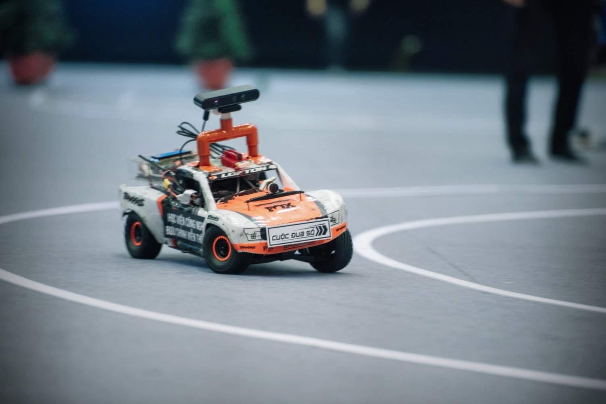
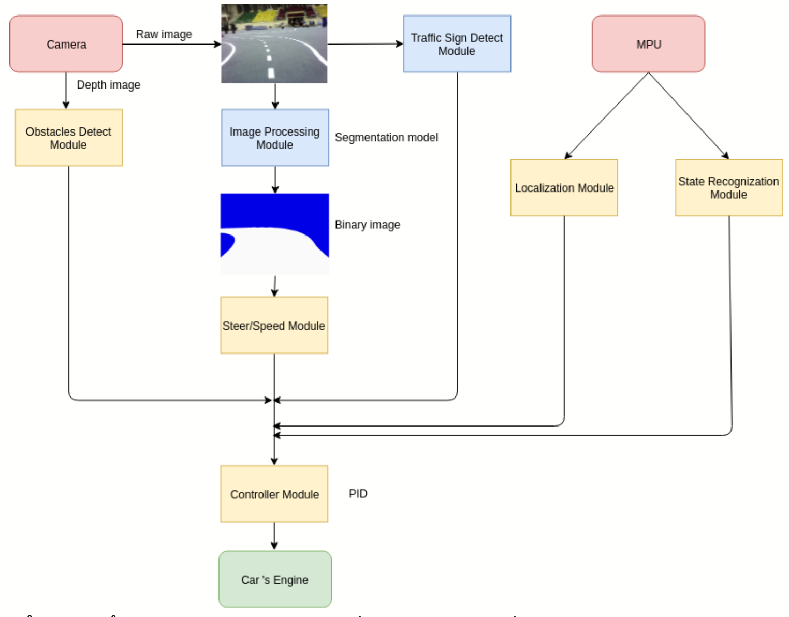

We made a self-driving car, brought it to the FPT Digital Race 2018-2019 contest, and got the 2nd Prize (2/200 teams).

Our car
======
Hardware: Jetson TX2

Technology
======
Computer Vision, Signal Processing

<em>Languages: Python, C/C++, Cython</em>

Prizes
======
* 2nd Prize @ National Contest
* Best Algorithm Prize
* 4th Prize @ Regional Contest (Northern)
* 1st Prize @ University Contest

Links
======
https://vnexpress.net/hoc-vien-ky-thuat-quan-su-chien-thang-cuoc-dua-so-2019-3929055.html

https://chungta.vn/cong-nghe/hoc-vien-ky-thuat-quan-su-vo-dich-cuoc-dua-so-mua-3-1125785.html
