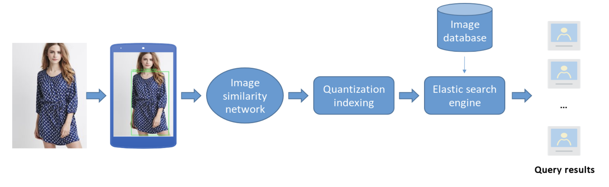

We made an app which automatically finds multiple similar clothing items from the large scaled database. The algorithm paper was published at a machine learning conference.

Our app
======
OS: Android

Technology
======
Computer Vision, Signal Processing

<em>Languages: Python, C/C++, Cython</em>

Links
======
https://vtv.vn/cong-nghe/su-dung-tri-tue-nhan-tao-quet-anh-xac-dinh-trang-phuc-tai-viet-nam-20180725092307993.htm
