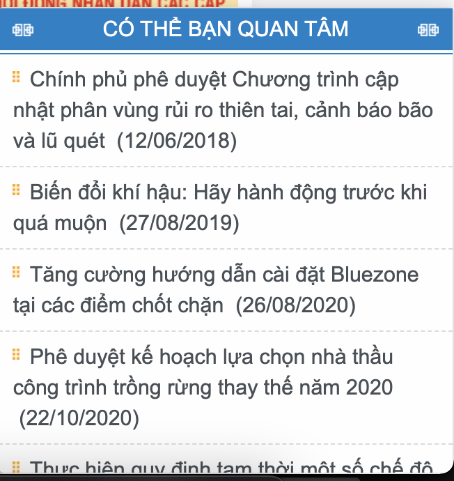

This is a national level research project. We applied content-based, session-based recommendation from our research to build a News Reccommendation System for website of Vietnam Ministry of Science and Technology (Bộ Khoa học Công nghệ) and the portal of Quang Nam province. Both websites have around 15.000 users activate daily.

https://www.most.gov.vn/vn/Pages/Index.aspx

https://quangnam.gov.vn/default.aspx

Our result
======
The project has been recored as successful by Vietnam Ministry of Science and Technology at Feb, 2021.
Testing evaluation result on real data with real user
- Recall@20: 0.4
- Prec@20: 0.4

