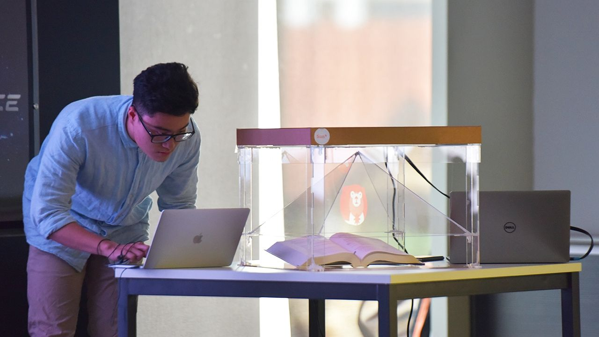
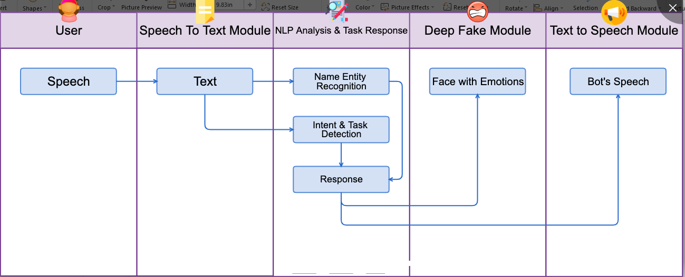

We made a lively, visual and practical model of "3D virtual assistant". Suntana brings a realistic experience to users, it can be personalized and specialized for certain tasks. For example: Welcome interviewees, meeting room booking .

Our product
======
OS: Ubuntu

Technology
======
Speech to text, Deep Fake, Speech Synthesize, Hologram 3D

<em>Languages: Python, C/C++</em>

Prizes
======
* 1st Prize (1/40 teams)

Links
======
https://news.sun-asterisk.com/en/p/winner-of-sun-hackathon-2019-suntana-the-3d-virtual-assistant-jLnWmlK3OoW
