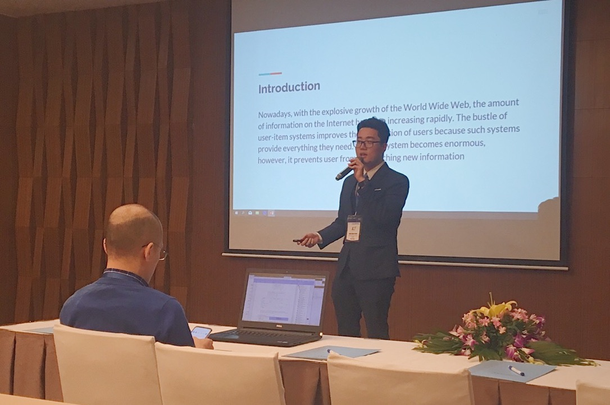

Abstract
======
The goal of session-based recommendation is to predict the next action of a user based on the current session and anonymous sessions before. Recent works on session-based recommendation usually use neural network architectures such as convolution neural networks (CNNs) or recurrent neural networks (RNNs) to extract patterns of sessions. Such features have been shown to give promising results because they can discover the user's sequential behavior and understand the purpose of current session. In this paper, we propose a neural network architecture for session-based recommendation without using convolution or recurrent neural networks. Our model is inspired by the Transformer's design, in which the information of important items is passed directly to the hidden states. Experimental results on two real-world datasets show that our method outperforms several state-of-the-art models.

Citation
======
> @inproceedings{anh2019session,
  title={Session-Based Recommendation with Self-Attention},
  author={Anh, Pham Hoang and Bach, Ngo Xuan and Phuong, Tu Minh},
  booktitle={Proceedings of the Tenth International Symposium on Information and Communication Technology},
  pages={1--8},
  year={2019}
}

Ha Long, Quang Ninh, 2019
======
